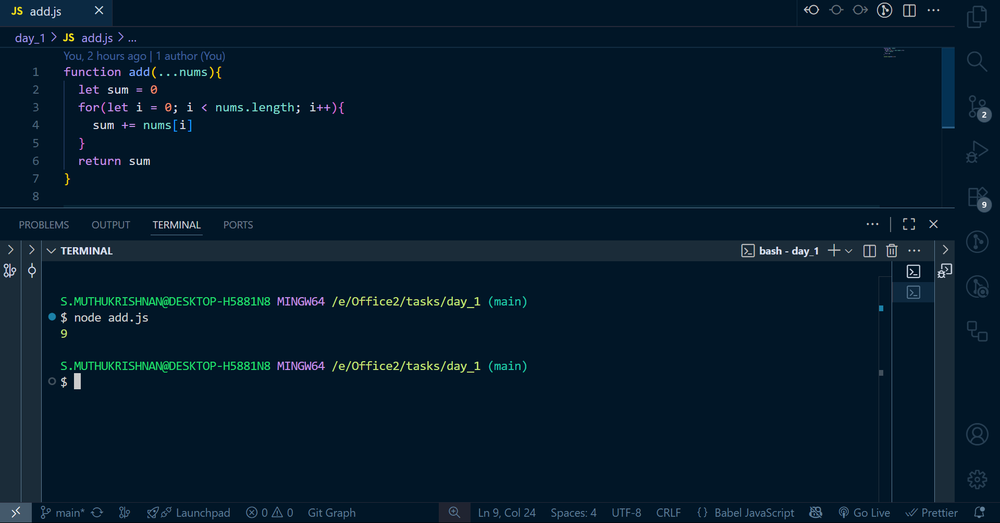
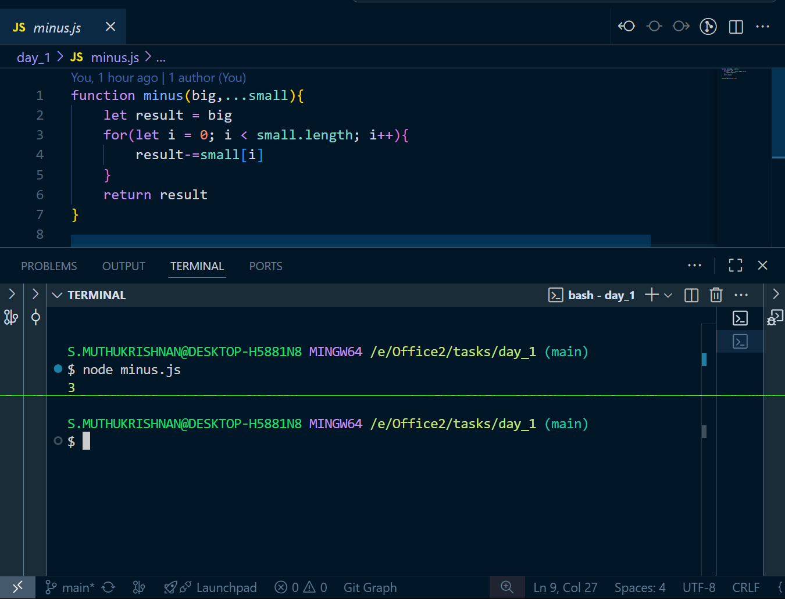
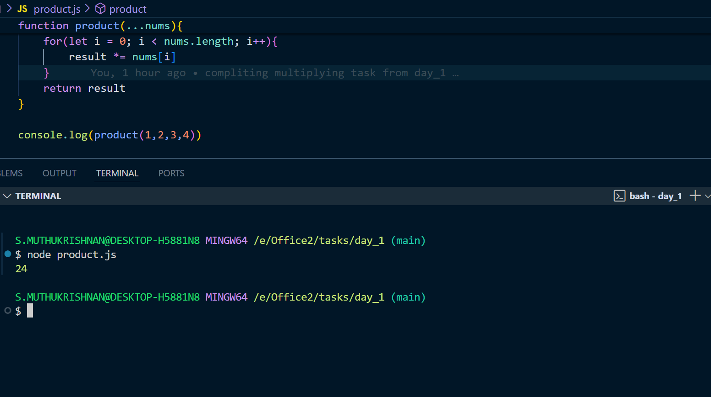
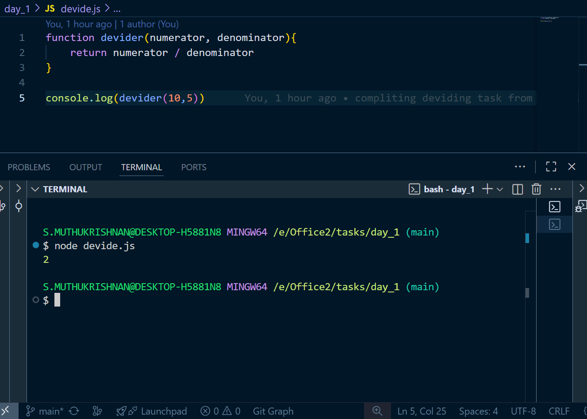

# Day 1 tasks

## 1. add.js

<pre lang="javascript">
function add(...nums) {
  let sum = 0;
  for (let i = 0; i < nums.length; i++) {
    sum += nums[i];
  }
  return sum;
}
console.log(add(2, 3, 4));
</pre>

### O/P

---

## 2. minus.js

<pre lang="javascript">
function minus(big, ...small) {
  let result = big;
  for (let i = 0; i < small.length; i++) {
    result -= small[i];
  }
  return result;
}
console.log(minus(10, 5, 2));
</pre>

### O/P

---

## 3. product.js

<pre lang="javascript">
function product(...nums) {
  let result = 1;
  for (let i = 0; i < nums.length; i++) {
    result *= nums[i];
  }
  return result;
}
console.log(product(1, 2, 3, 4));
</pre>

### O/P

---

## 4. devide.js

<pre lang="javascript">
function devider(numerator, denominator) {
  return numerator / denominator;
}
console.log(devider(10, 5));
</pre>

### O/P

