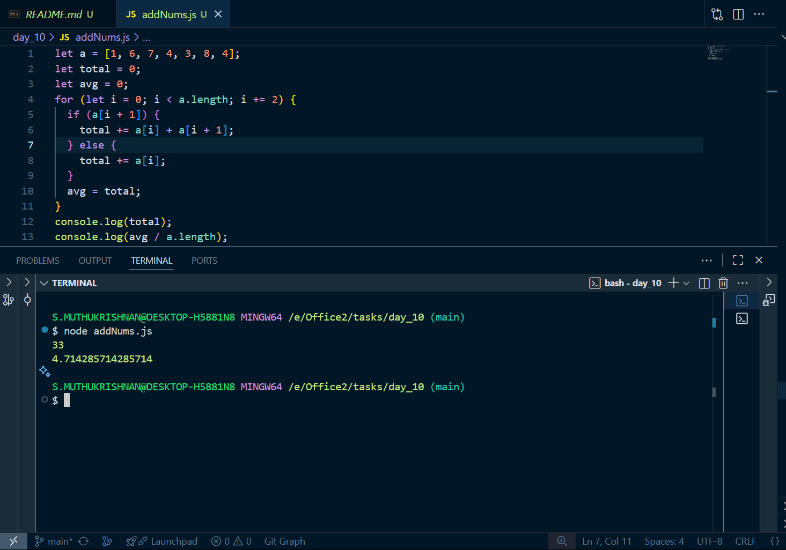
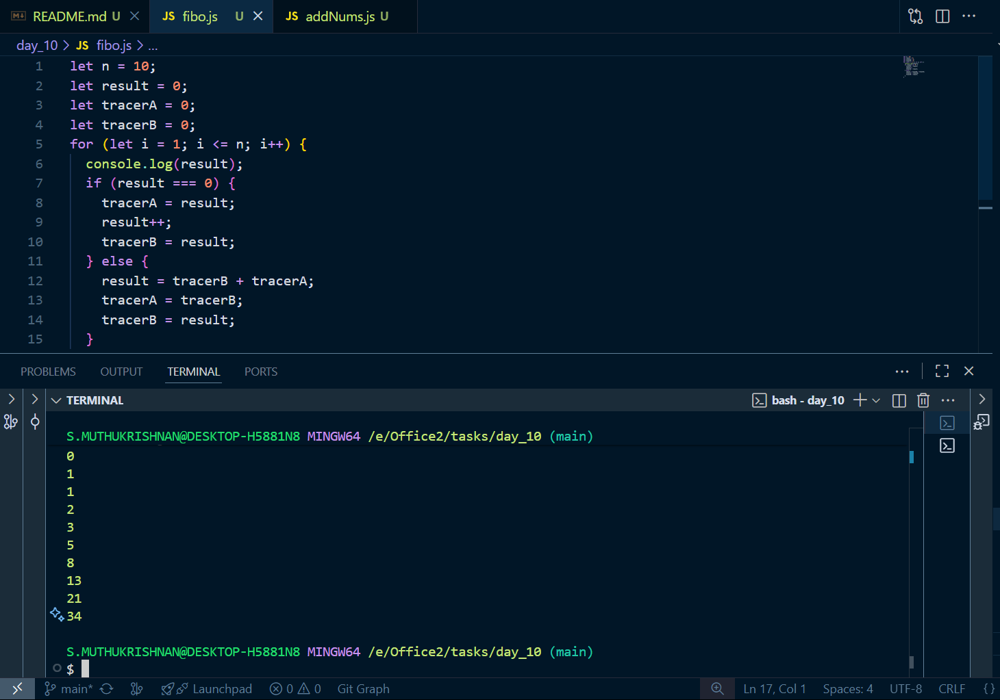
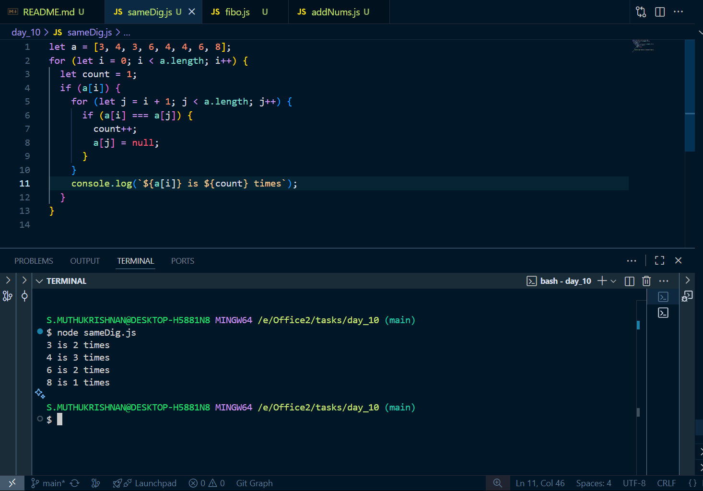

# Day 9 tasks

## 1. addNums.js

<pre lang="javascript">
let a = [1, 6, 7, 4, 3, 8, 4];
let total = 0;
let avg = 0;
for (let i = 0; i < a.length; i += 2) {
  if (a[i + 1]) {
    total += a[i] + a[i + 1];
  } else {
    total += a[i];
  }
  avg = total;
}
console.log(total);
console.log(avg / a.length);
</pre>

### O/P

---

## 2. fibo.js

<pre lang="javascript">
let n = 10;
let result = 0;
let tracerA = 0;
let tracerB = 0;
for (let i = 1; i <= n; i++) {
  console.log(result);
  if (result === 0) {
    tracerA = result;
    result++;
    tracerB = result;
  } else {
    result = tracerB + tracerA;
    tracerA = tracerB;
    tracerB = result;
  }
}

</pre>

### O/P

---

## 3. sameDig.js

<pre lang="javascript">
let a = [3, 4, 3, 6, 4, 4, 6, 8];
for (let i = 0; i < a.length; i++) {
  let count = 1;
  if (a[i]) {
    for (let j = i + 1; j < a.length; j++) {
      if (a[i] === a[j]) {
        count++;
        a[j] = null;
      }
    }
    console.log(`${a[i]} is ${count} times`);
  }
}
</pre>

### O/P

