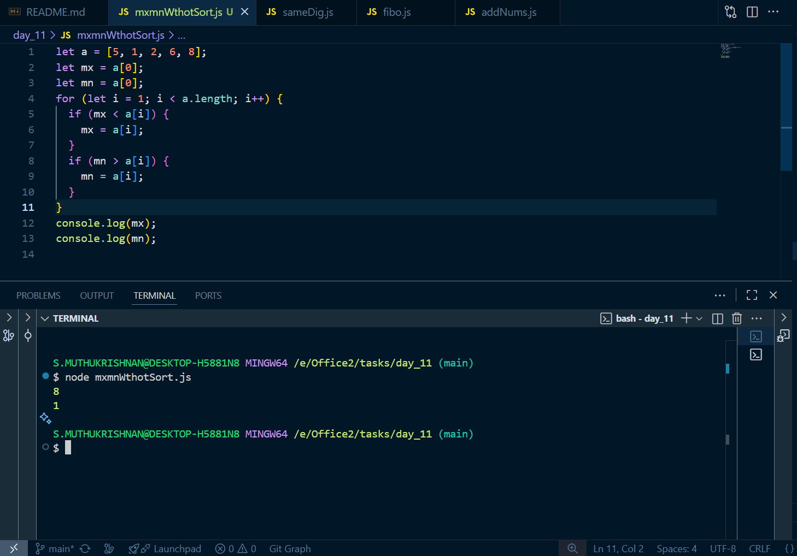
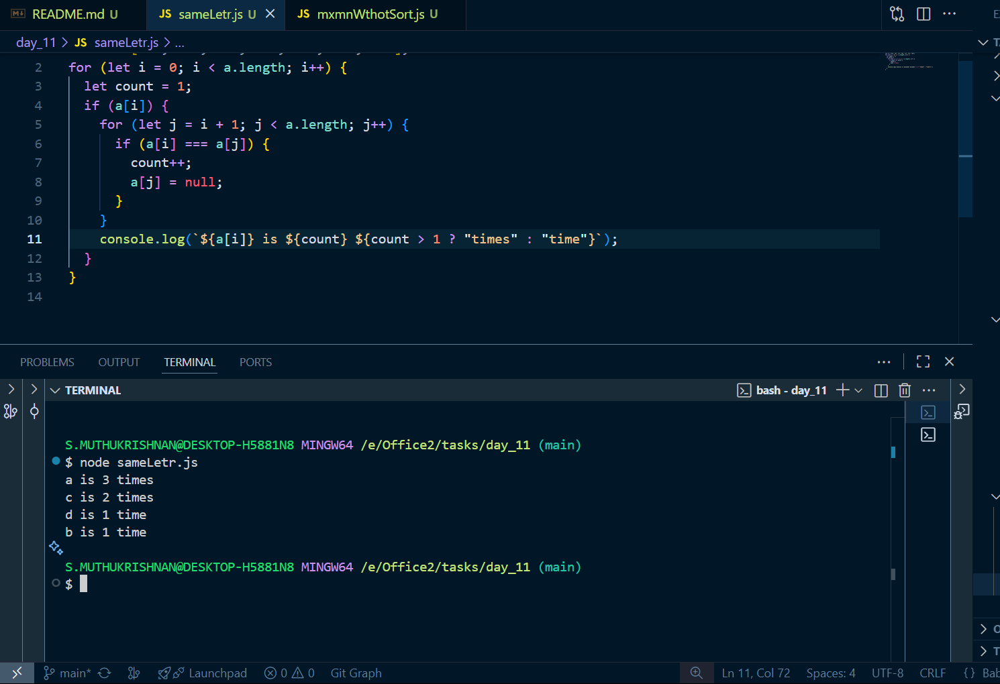

# Day 11 tasks

## 1. mxmnWthotSort.js

<pre lang="javascript">
let a = [5, 1, 2, 6, 8];
let mx = a[0];
let mn = a[0];
for (let i = 1; i < a.length; i++) {
  if (mx < a[i]) {
    mx = a[i];
  }
  if (mn > a[i]) {
    mn = a[i];
  }
}
console.log(mx);
console.log(mn);
</pre>

### O/P

---

## 2. sameLetr.js

<pre lang="javascript">
let a = ["a", "a", "c", "d", "c", "a", "b"];
for (let i = 0; i < a.length; i++) {
  let count = 1;
  if (a[i]) {
    for (let j = i + 1; j < a.length; j++) {
      if (a[i] === a[j]) {
        count++;
        a[j] = null;
      }
    }
    console.log(`${a[i]} is ${count} ${count > 1 ? "times" : "time"}`);
  }
}

</pre>

### O/P

