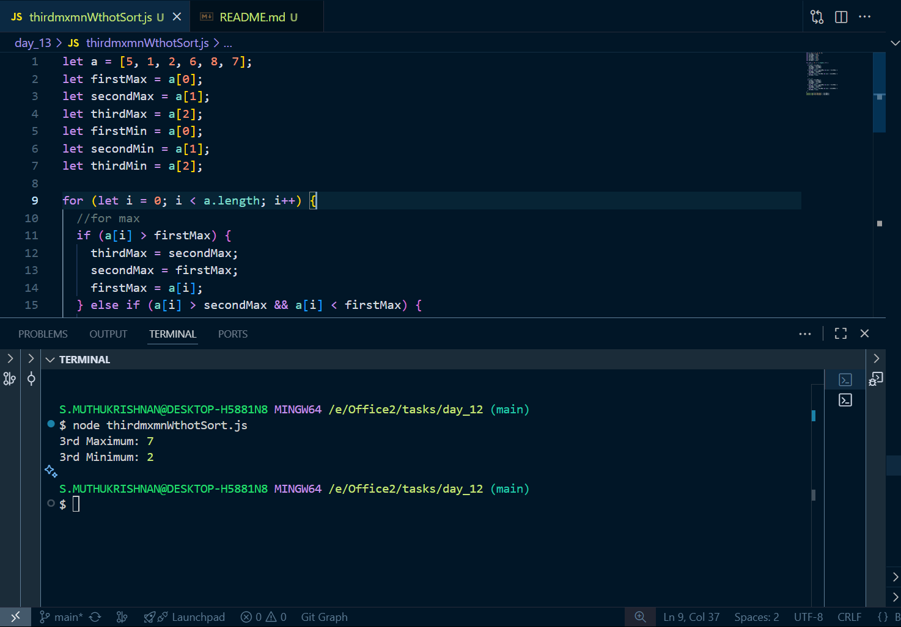
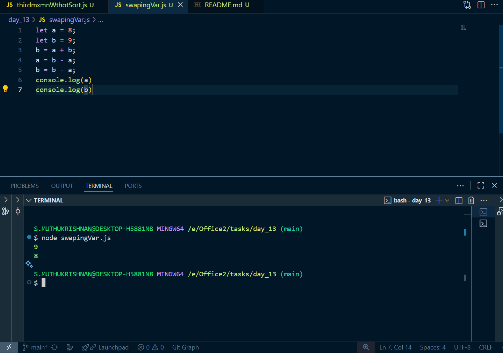

# Day 13 tasks

## 1. thirdmxmnWthotSort.js

<pre lang="javascript">
let a = [5, 1, 2, 6, 8, 7];
let firstMax = a[0];
let secondMax = a[1];
let thirdMax = a[2];
let firstMin = a[0];
let secondMin = a[1];
let thirdMin = a[2];

for (let i = 0; i < a.length; i++) {
  //for max
  if (a[i] > firstMax) {
    thirdMax = secondMax;
    secondMax = firstMax;
    firstMax = a[i];
  } else if (a[i] > secondMax && a[i] < firstMax) {
    thirdMax = secondMax;
    secondMax = a[i];
  } else if (a[i] > thirdMax && a[i] < secondMax) {
    thirdMax = a[i];
  }

  //for min
  if (a[i] < firstMax) {
    thirdMax = secondMax;
    secondMax = firstMax;
    firstMax = a[i];
  } else if (a[i] < secondMax && a[i] > firstMax) {
    thirdMax = secondMax;
    secondMax = a[i];
  } else if (a[i] < thirdMax && a[i] > secondMax) {
    thirdMax = a[i];
  }
}
console.log("3rd Maximum:", thirdMax);
console.log("3rd Minimum:", thirdMin);
</pre>

### O/P

---

## 2. swapingVar.js

<pre lang="javascript">
let a = 8;
let b = 9;
b = a + b;
a = b - a;
b = b - a;
console.log(a)
console.log(b)

</pre>

### O/P

---

## 3. hollowPyramid.js

<pre lang="javascript">
let n = 4
for(let i =1; i <= n; i++){
    for(let j = i; j <n ; j++){
        process.stdout.write(" ")
    }
    for(let j = 1; j <= i; j++){
        if(j === 1 || j === i || i === n){
            process.stdout.write("*"+" ")
        }else{
            process.stdout.write("  ")
        }
    }
    console.log()
}

</pre>

### O/P

