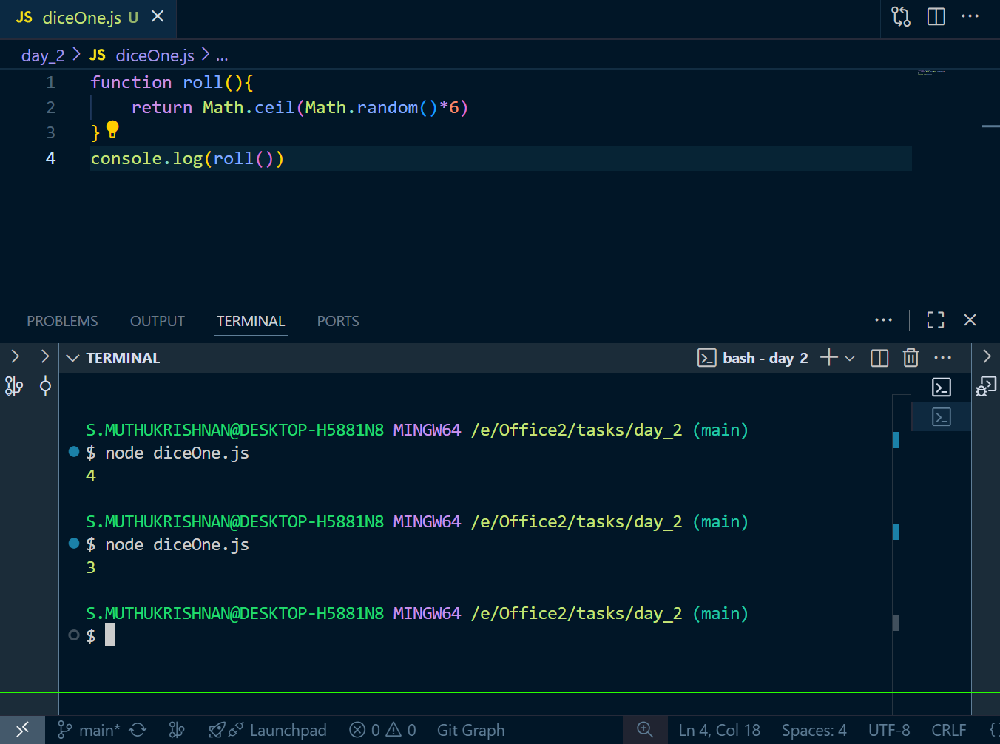
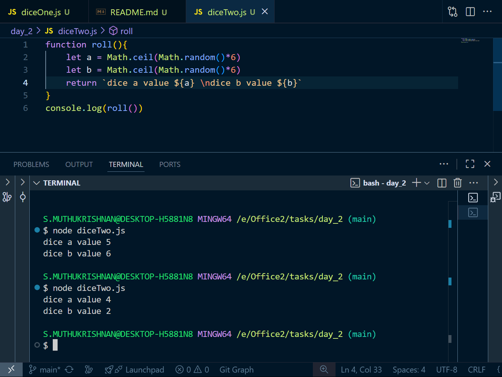
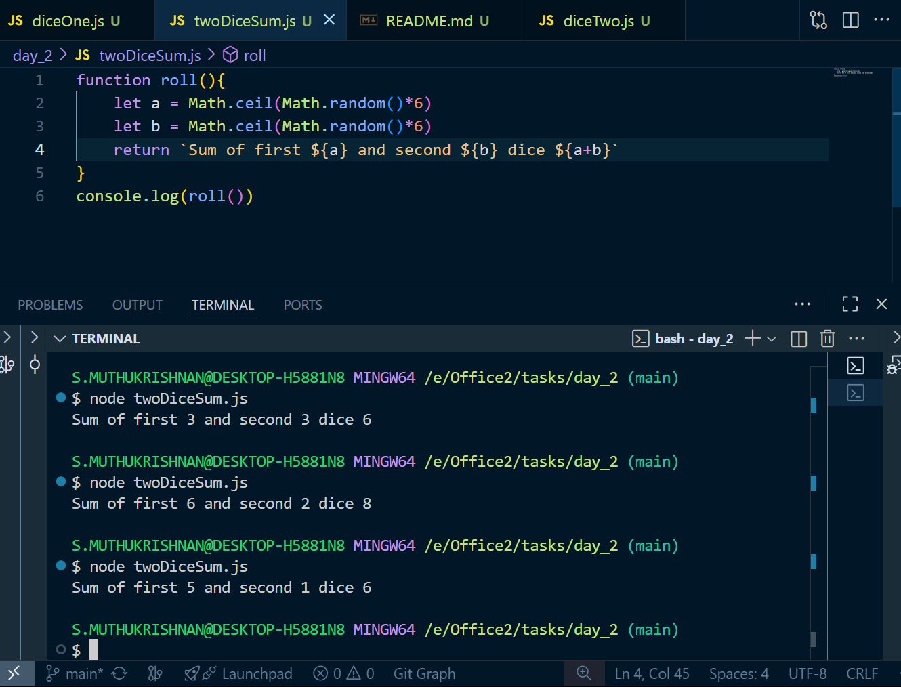
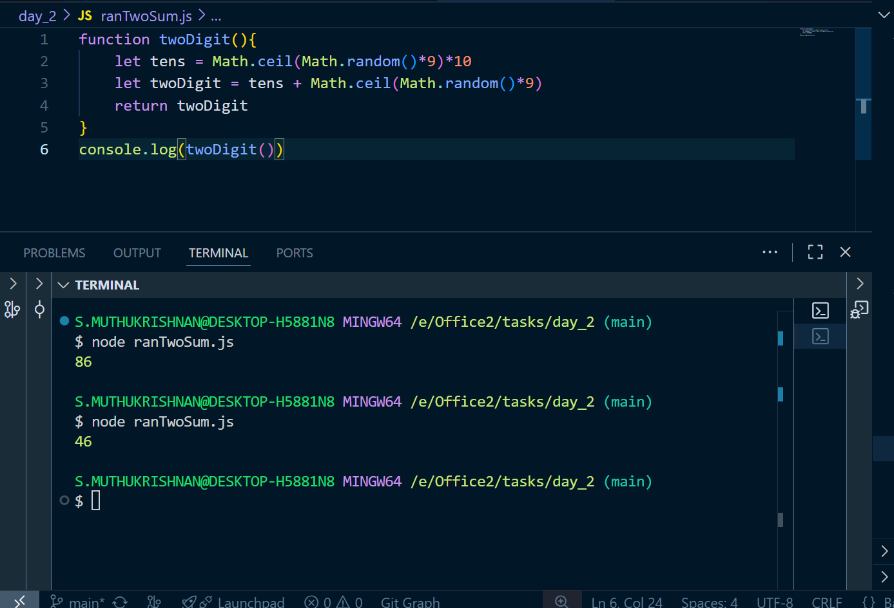
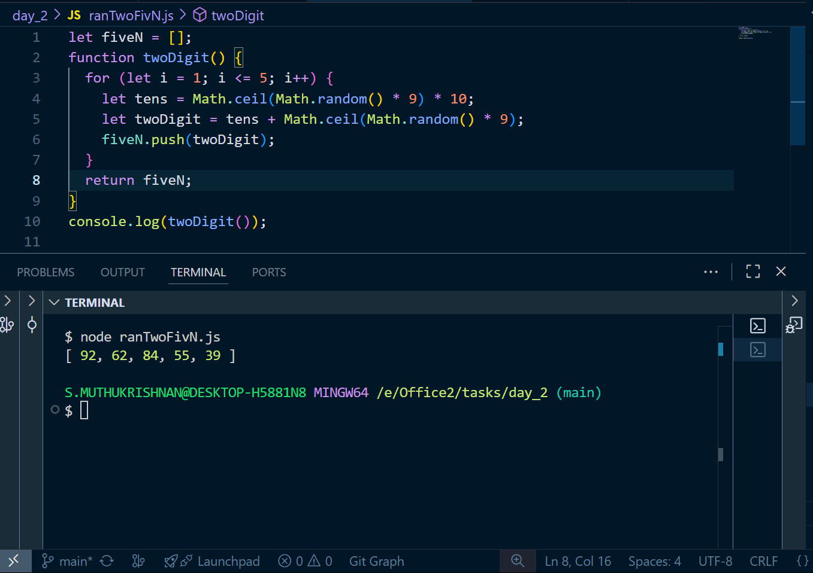
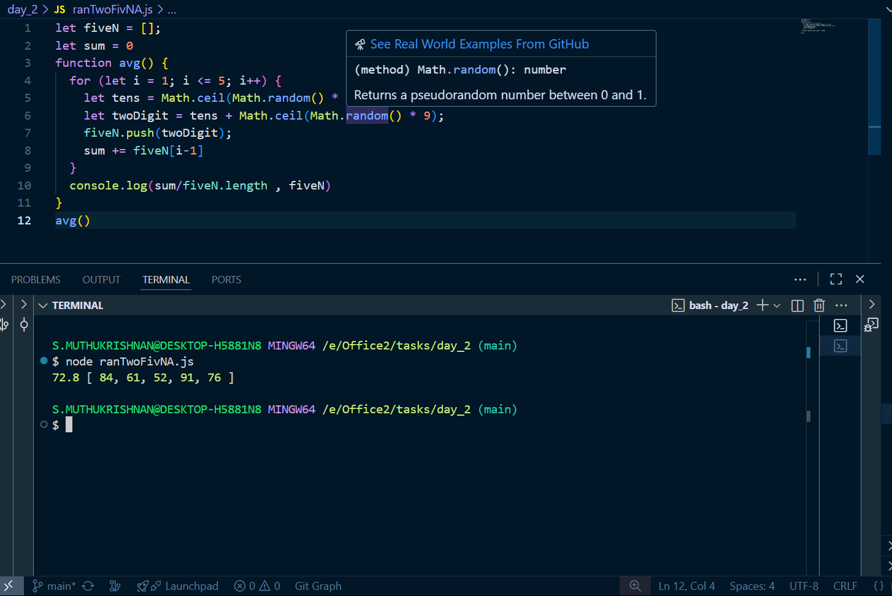
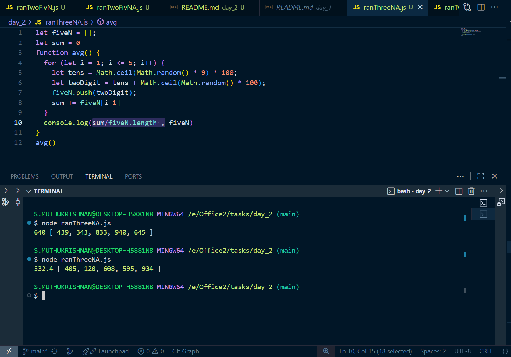
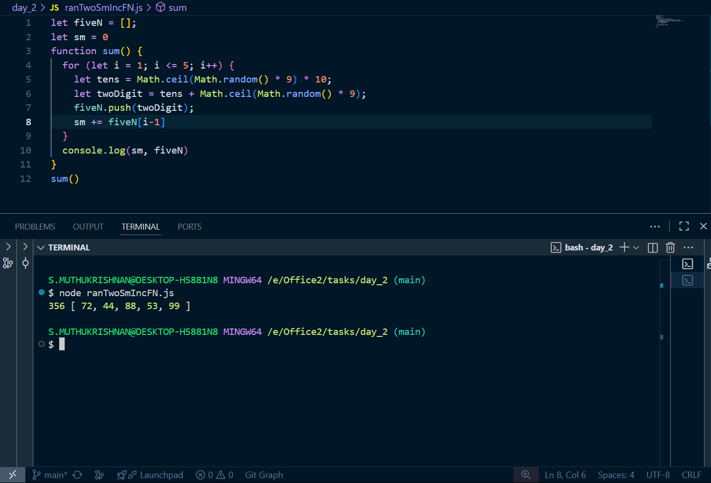
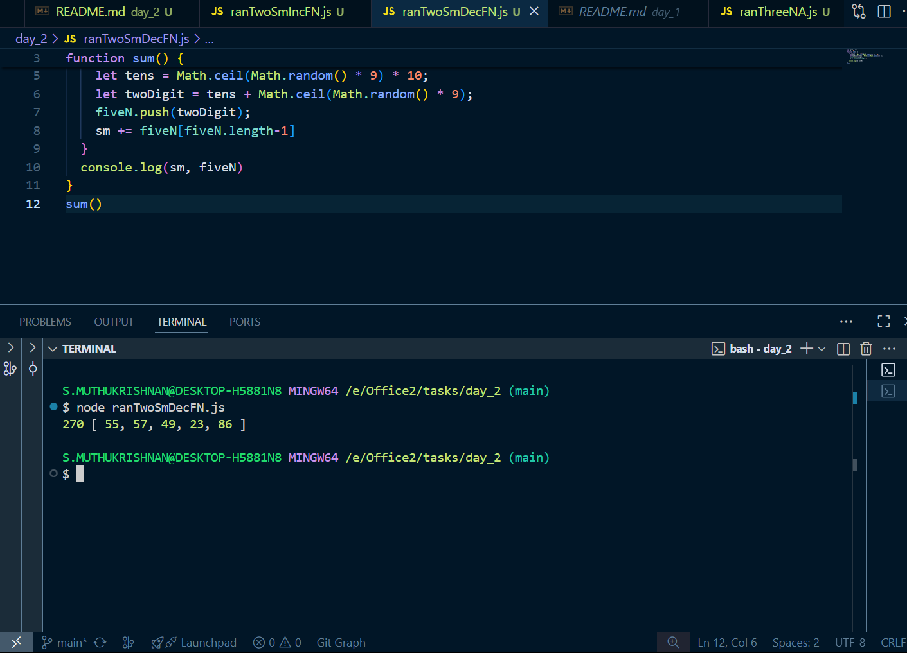
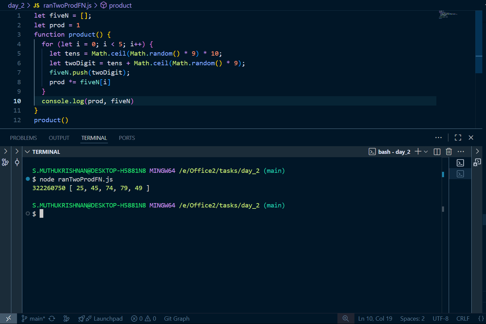

# Day 2 tasks

## 1. diceOne.js

<pre lang="javascript">
function add(...nums) {
  let sum = 0;
  for (let i = 0; i < nums.length; i++) {
    sum += nums[i];
  }
  return sum;
}
console.log(add(2, 3, 4));
</pre>

### O/P

---

## 2. diceTwo.js

<pre lang="javascript">
function roll() {
  let a = Math.ceil(Math.random() * 6);
  let b = Math.ceil(Math.random() * 6);
  return `dice a value ${a} \ndice b value ${b}`;
}
console.log(roll());
</pre>

### O/P

---

## 3. twoDiceSum.js

<pre lang="javascript">
function roll() {
  let a = Math.ceil(Math.random() * 6);
  let b = Math.ceil(Math.random() * 6);
  return `Sum of first ${a} and second ${b} dice ${a + b}`;
}
console.log(roll());
</pre>

### O/P

---

## 4. ranTwoSum.js

<pre lang="javascript">
function twoDigit() {
  let tens = Math.ceil(Math.random() * 9) * 10;
  let twoDigit = tens + Math.ceil(Math.random() * 9);
  return twoDigit;
}
console.log(twoDigit());
</pre>

### O/P

---

## 5. ranTwoFivN.js

<pre lang="javascript">
let fiveN = [];
function twoDigit() {
  for (let i = 1; i <= 5; i++) {
    let tens = Math.ceil(Math.random() * 9) * 10;
    let twoDigit = tens + Math.ceil(Math.random() * 9);
    fiveN.push(twoDigit);
  }
  return fiveN;
}
console.log(twoDigit());
</pre>

### O/P

---

## 6. ranTwoFivNA.js

<pre lang="javascript">
let fiveN = [];
let sum = 0;
function avg() {
  for (let i = 1; i <= 5; i++) {
    let tens = Math.ceil(Math.random() * 9) * 10;
    let twoDigit = tens + Math.ceil(Math.random() * 9);
    fiveN.push(twoDigit);
    sum += fiveN[i - 1];
  }
  console.log(sum / fiveN.length, fiveN);
}
avg();
</pre>

### O/P

---

## 7. ranThreeFivNA.js

<pre lang="javascript">
let fiveN = [];
let sum = 0;
function avg() {
  for (let i = 1; i <= 5; i++) {
    let tens = Math.ceil(Math.random() * 9) * 100;
    let twoDigit = tens + Math.ceil(Math.random() * 100);
    fiveN.push(twoDigit);
    sum += fiveN[i - 1];
  }
  console.log(sum / fiveN.length, fiveN);
}
avg();
</pre>

### O/P

---

## 8. ranTwoSmIncFN.js

<pre lang="javascript">
let fiveN = [];
let sm = 0;
function sum() {
  for (let i = 1; i <= 5; i++) {
    let tens = Math.ceil(Math.random() * 9) * 10;
    let twoDigit = tens + Math.ceil(Math.random() * 9);
    fiveN.push(twoDigit);
    sm += fiveN[i - 1];
  }
  console.log(sm, fiveN);
}
sum();
</pre>

### O/P

---

## 9. ranTwoSmDecFN.js

<pre lang="javascript">
let fiveN = [];
let sm = 0;
function sum() {
  for (let i = 1; i <= 5; i++) {
    let tens = Math.ceil(Math.random() * 9) * 10;
    let twoDigit = tens + Math.ceil(Math.random() * 9);
    fiveN.push(twoDigit);
    sm += fiveN[fiveN.length - 1];
  }
  console.log(sm, fiveN);
}
sum();
</pre>

### O/P

---

## 10. ranTwoProdFN.js

<pre lang="javascript">
let fiveN = [];
let prod = 1;
function product() {
  for (let i = 0; i < 5; i++) {
    let tens = Math.ceil(Math.random() * 9) * 10;
    let twoDigit = tens + Math.ceil(Math.random() * 9);
    fiveN.push(twoDigit);
    prod *= fiveN[i];
  }
  console.log(prod, fiveN);
}
product();
</pre>

### O/P

