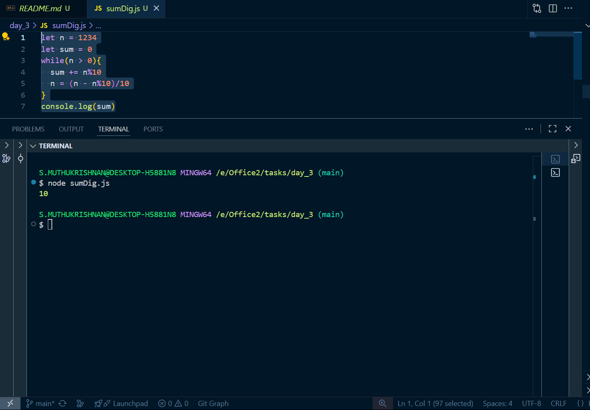
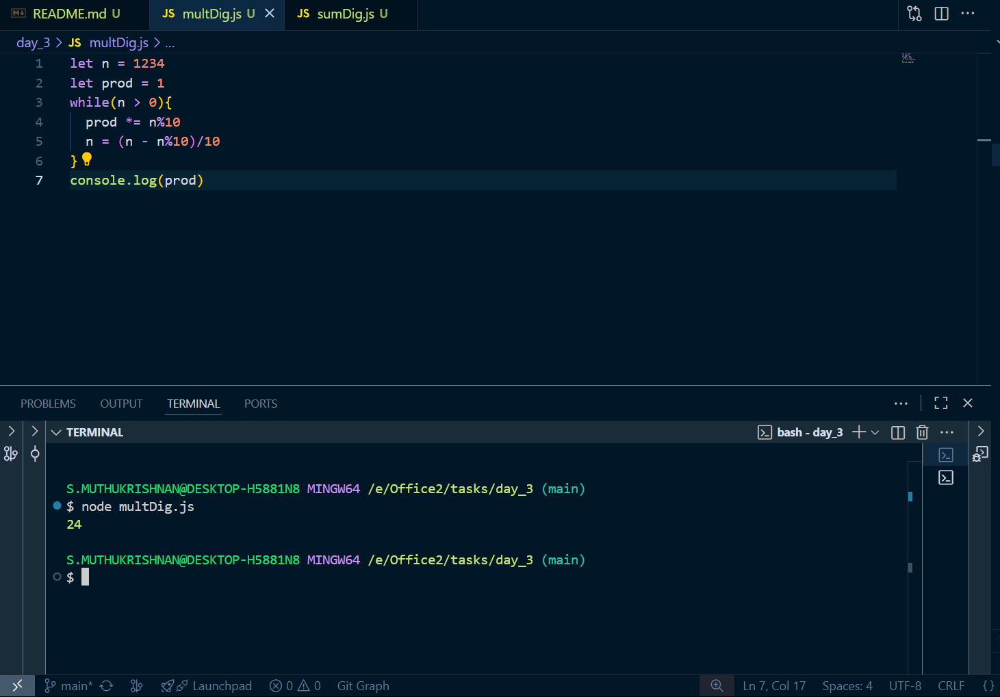
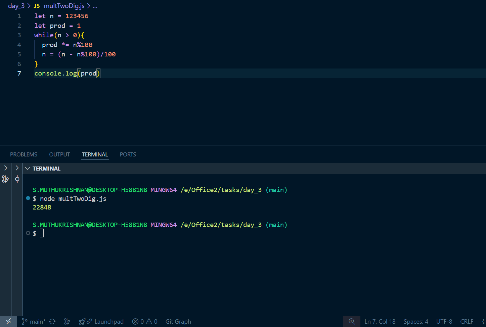
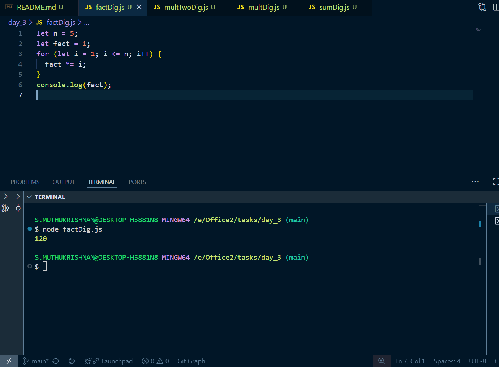
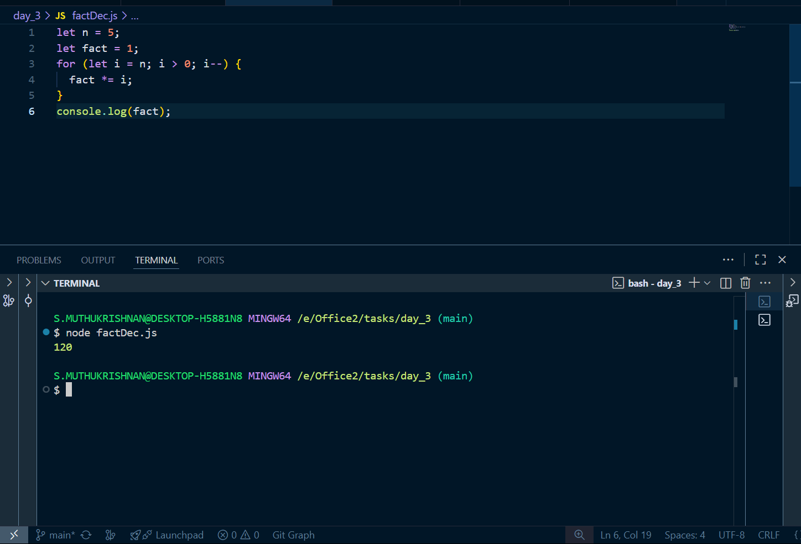

# Day 2 tasks

## 1.sumDig.js

<pre lang="javascript">
let n = 1234
let sum = 0
while(n > 0){
  sum += n%10
  n = (n - n%10)/10
}
console.log(sum)
</pre>

### O/P

## 2.multDig.js
let n = 1234
let prod = 1
while(n > 0){
  prod *= n%10
  n = (n - n%10)/10
}
console.log(prod)
</pre>
### O/P

## 3.multTwoDig.js
<pre lang="javascript">
let n = 123456
let prod = 1
while(n > 0){
  prod *= n%100
  n = (n - n%100)/100
}
console.log(prod)
</pre>
### O/P

## 4.factDig.js
<pre lang="javascript">
let n = 5;
let fact = 1;
for (let i = 1; i <= n; i++) {
  fact *= i;
}
console.log(fact);
</pre>
### O/P

## 5.factDec.js
<pre lang="javascript">
let n = 5;
let fact = 1;
for (let i = n; i > 0; i--) {
  fact *= i;
}
console.log(fact);
</pre>
### O/P

