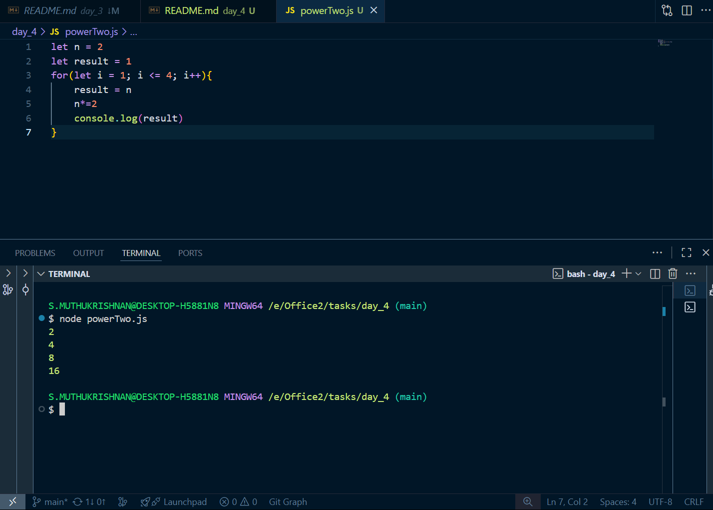
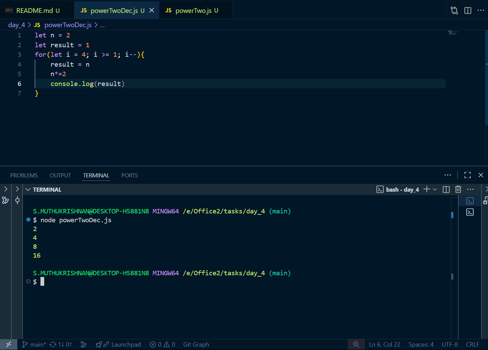
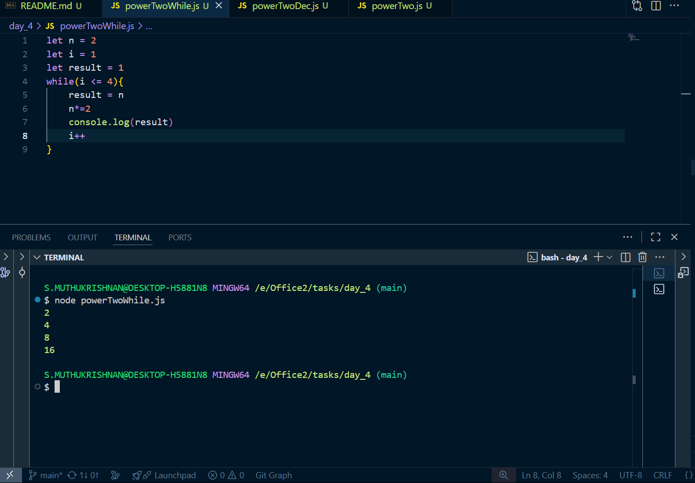

# Day 2 tasks

## 1.powerTwo.js

<pre lang="javascript">
let n = 2
let result = 1
for(let i = 1; i <= 4; i++){
    result = n
    n*=2
    console.log(result)
}
</pre>

### O/P

## 2.powerTwoDec.js
<pre lang="javascript">
let n = 2
let result = 1
for(let i = 4; i >= 1; i--){
    result = n
    n*=2
    console.log(result)
}

</pre>
### O/P

## 3.powerTwoWhile.js

<pre lang="javascript">
let n = 2
let i = 1
let result = 1 
while(i <= 4){
    result = n
    n*=2
    console.log(result)
    i++
}
</pre>

### O/P

## 4.factDig.js

<pre lang="javascript">
let n = 5;
let fact = 1;
for (let i = 1; i <= n; i++) {
  fact *= i;
}
console.log(fact);
</pre>

### O/P

## 5.factDec.js

<pre lang="javascript">
let n = 5;
let fact = 1;
for (let i = n; i > 0; i--) {
  fact *= i;
}
console.log(fact);
</pre>

### O/P

