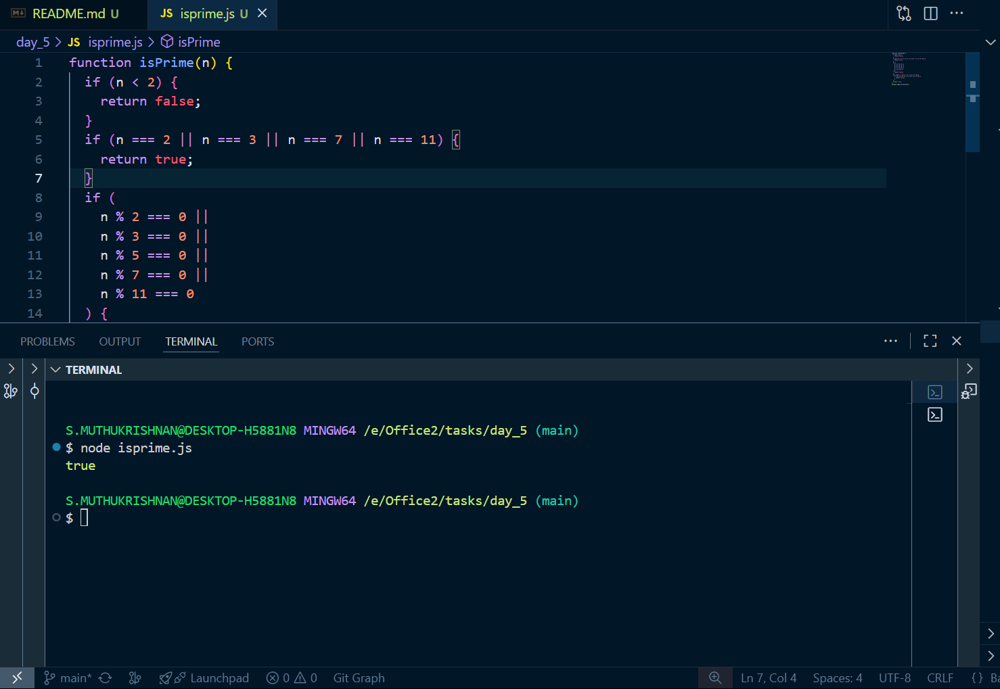
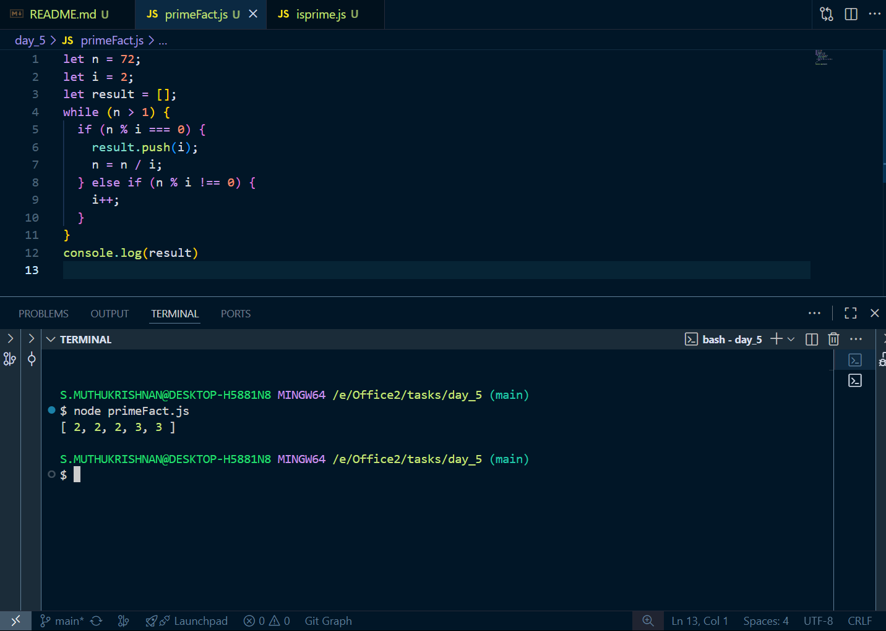

# Day 2 tasks

## 1. isprime.js

<pre lang="javascript">
function isPrime(n) {
  if (n < 2) {
    return false;
  }

  if (n === 2 || n === 3 || n === 7 || n === 11) {
    return true;
  }

  if (
    n % 2 === 0 ||
    n % 3 === 0 ||
    n % 5 === 0 ||
    n % 7 === 0 ||
    n % 11 === 0
  ) {
    return false;
  }

  for (let i = 13; i * i <= n; i += 6) {
    if (n % i === 0 || n % (i + 2) === 0) {
      return false;
    }
  }

  return true;
}

console.log(isPrime(167));
</pre>

### O/P

---

## 2. primeFact.js

<pre lang="javascript">
let n = 72;
let i = 2;
let result = [];

while (n > 1) {
  if (n % i === 0) {
    result.push(i);
    n = n / i;
  } else if (n % i !== 0) {
    i++;
  }
}

console.log(result);
</pre>

### O/P

