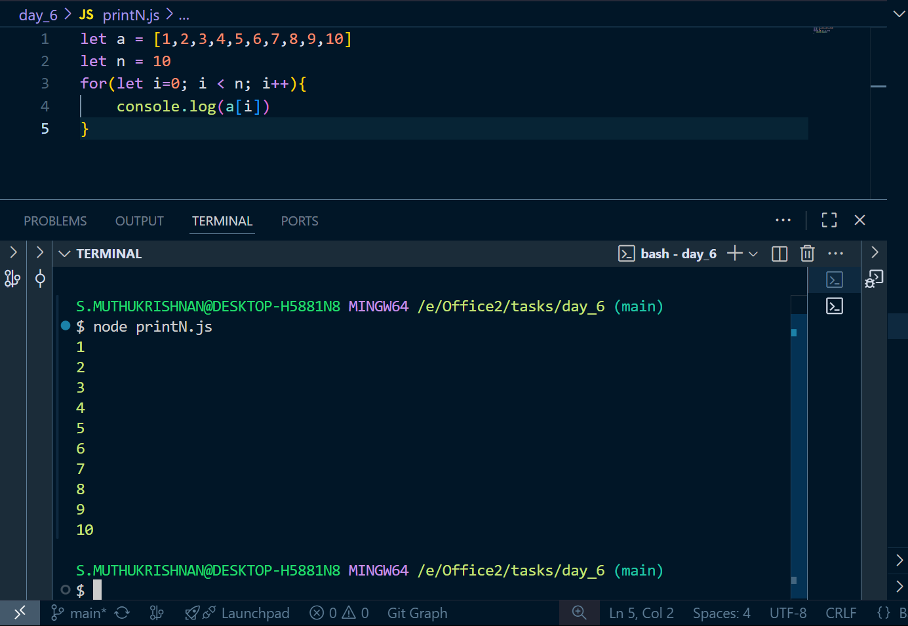
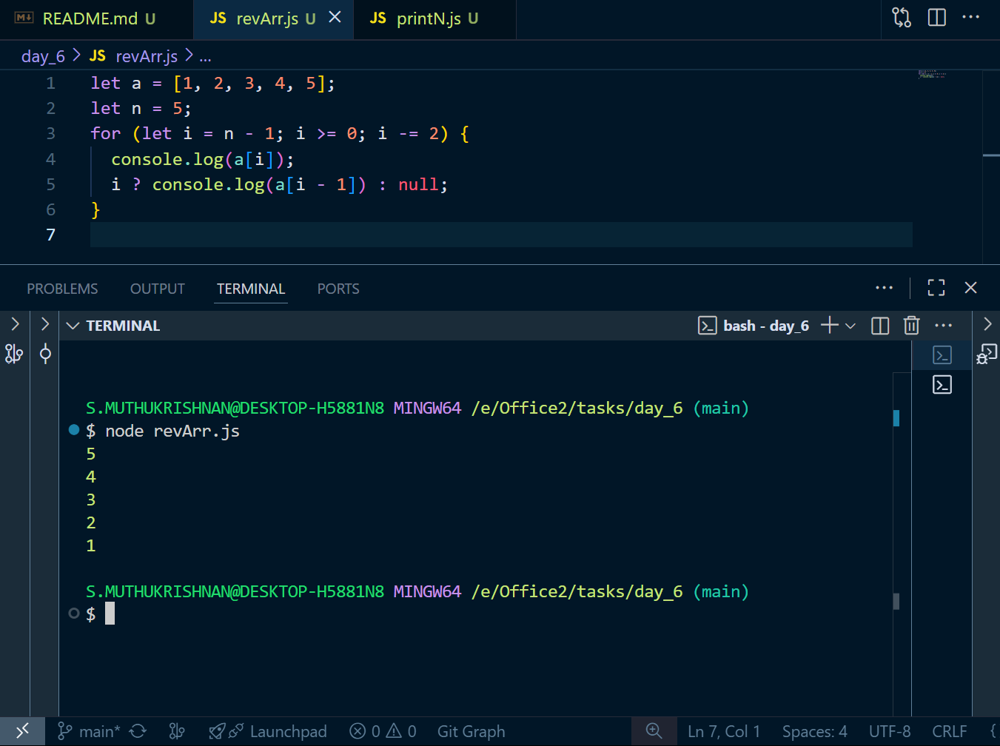
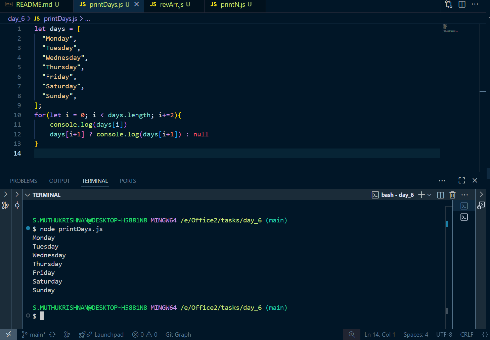

# Day 2 tasks

## 1. printN.js

<pre lang="javascript">
let a = [1,2,3,4,5,6,7,8,9,10]
let n = 10
for(let i=0; i < n; i++){
    console.log(a[i])
}
</pre>

### O/P

---

## 2. revArr.js

<pre lang="javascript">
let a = [1, 2, 3, 4, 5];
let n = 5;
for (let i = n - 1; i >= 0; i -= 2) {
  console.log(a[i]);
  i ? console.log(a[i - 1]) : null;
}
</pre>

### O/P

---

## 3. revArr.js

<pre lang="javascript">
let days = [
  "Monday",
  "Tuesday",
  "Wednesday",
  "Thursday",
  "Friday",
  "Saturday",
  "Sunday",
];
for(let i = 0; i < days.length; i+=2){
    console.log(days[i])
    days[i+1] ? console.log(days[i+1]) : null
}
</pre>

### O/P

