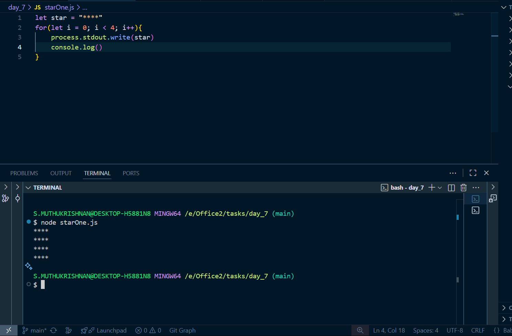
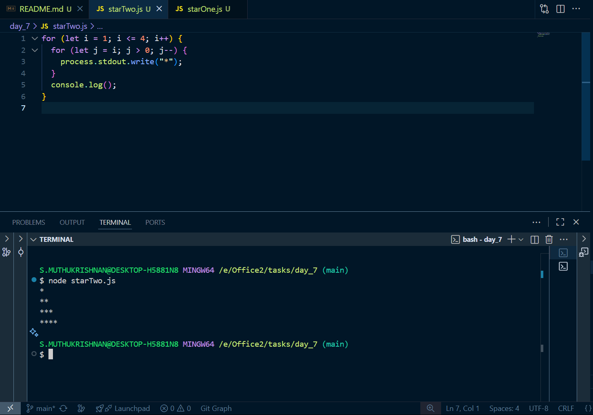
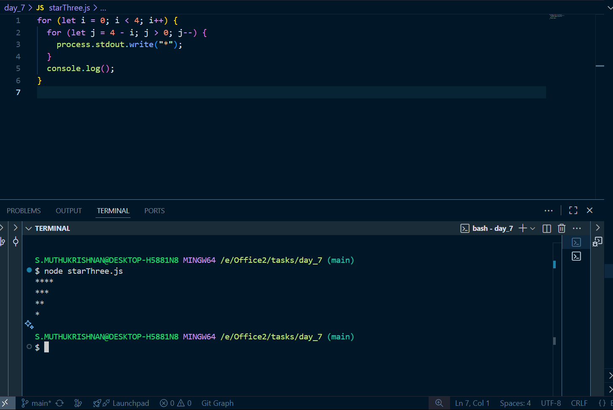
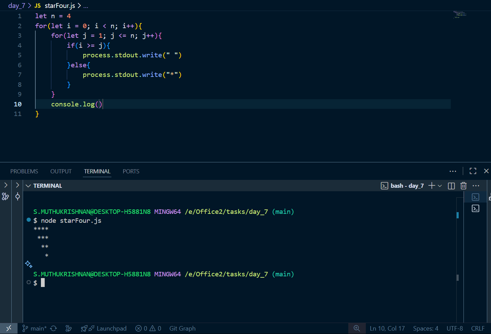
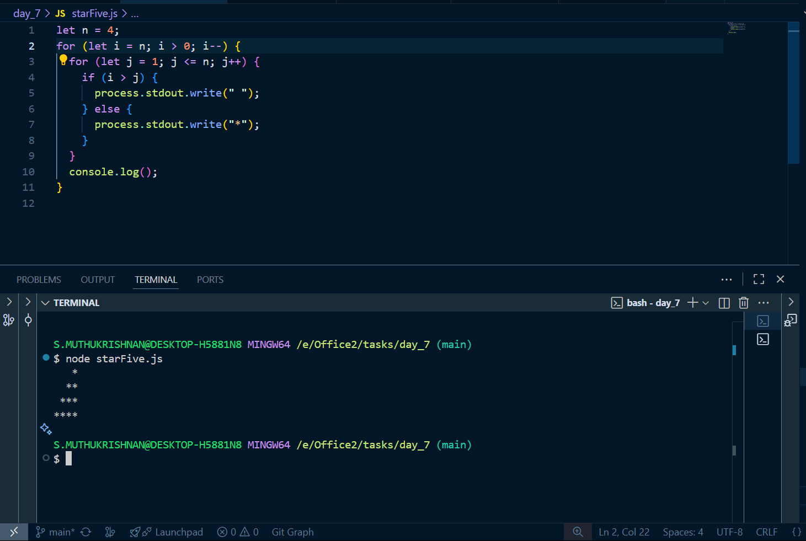

# Day 7 tasks

## 1. starOne.js

<pre lang="javascript">
let star = "****"
for(let i = 0; i < 4; i++){
    process.stdout.write(star)
    console.log()
}
</pre>

### O/P

---

## 2. starTwo.js

<pre lang="javascript">
for (let i = 1; i <= 4; i++) {
  for (let j = i; j > 0; j--) {
    process.stdout.write("*");
  }
  console.log();
}
</pre>

### O/P

---

## 3. starThree.js

<pre lang="javascript">
for (let i = 0; i < 4; i++) {
  for (let j = 4 - i; j > 0; j--) {
    process.stdout.write("*");
  }
  console.log();
}
</pre>

### O/P

---

## 4. starFour.js

<pre lang="javascript">
let n = 4
for(let i = 0; i < n; i++){
    for(let j = 1; j <= n; j++){
        if(i >= j){
            process.stdout.write(" ")
        }else{
            process.stdout.write("*")
        }
    }
    console.log()
}
</pre>

### O/P

---

## 5. starFive.js

<pre lang="javascript">
let n = 4;
for (let i = n; i > 0; i--) {
  for (let j = 1; j <= n; j++) {
    if (i > j) {
      process.stdout.write(" ");
    } else {
      process.stdout.write("*");
    }
  }
  console.log();
}
</pre>

### O/P

