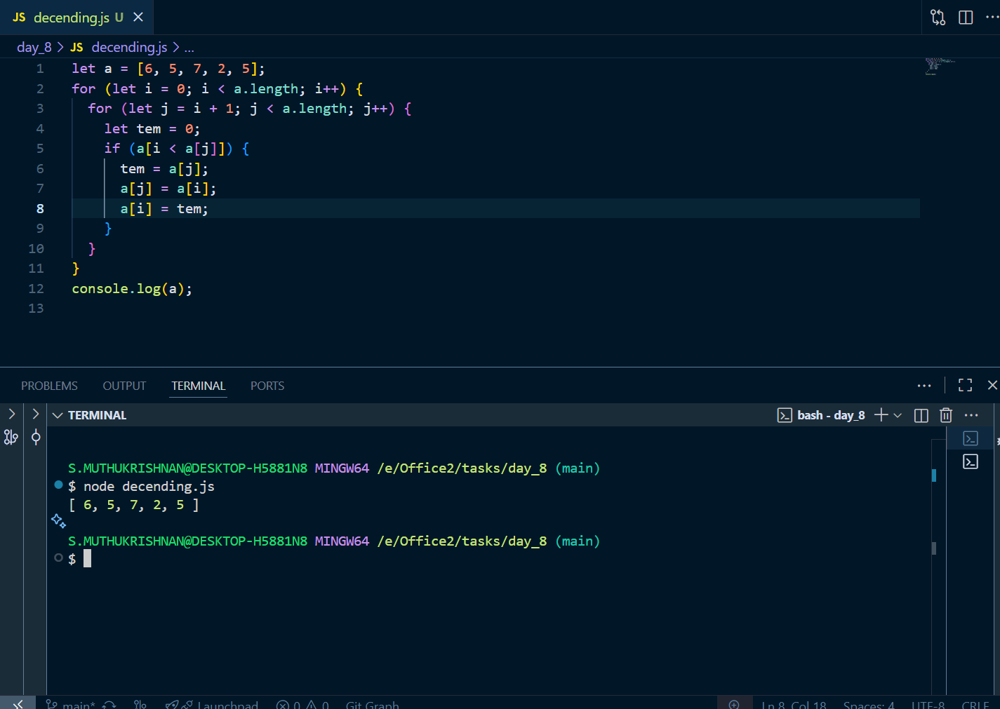
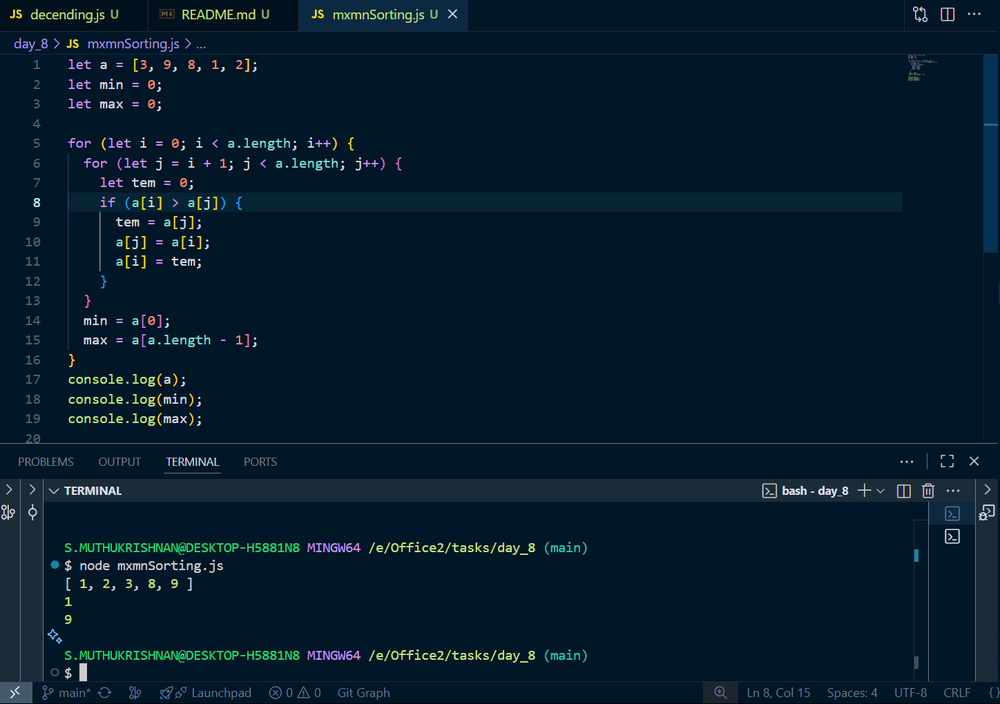
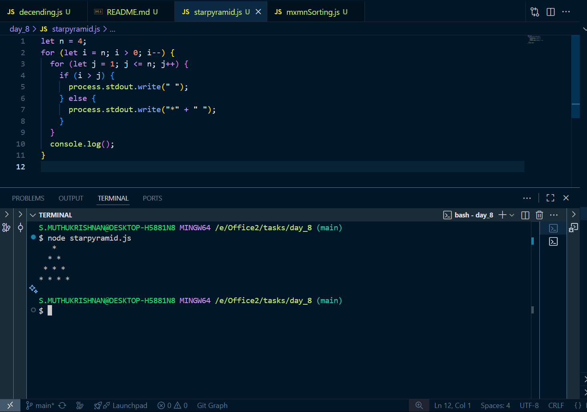
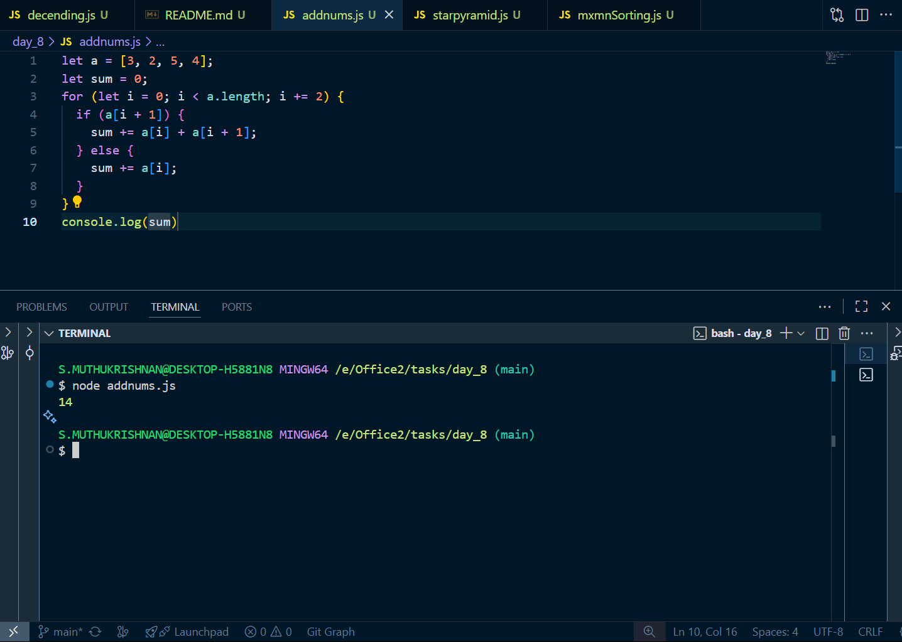

# Day 8 tasks

## 1. decending.js

<pre lang="javascript">
let a = [6, 5, 7, 2, 5];
for (let i = 0; i < a.length; i++) {
  for (let j = i + 1; j < a.length; j++) {
    let tem = 0;
    if (a[i < a[j]]) {
      tem = a[j];
      a[j] = a[i];
      a[i] = tem;
    }
  }
}
console.log(a);
</pre>

### O/P

---

## 2. mxmnSorting.js

<pre lang="javascript">
let a = [3, 9, 8, 1, 2];
let min = 0;
let max = 0;

for (let i = 0; i < a.length; i++) {
  for (let j = i + 1; j < a.length; j++) {
    let tem = 0;
    if (a[i] > a[j]) {
      tem = a[j];
      a[j] = a[i];
      a[i] = tem;
    }
  }
  min = a[0];
  max = a[a.length - 1];
}
console.log(a);
console.log(min);
console.log(max);
</pre>

### O/P

---

## 3. starpyramid.js

<pre lang="javascript">
for (let i = 0; i < 4; i++) {
  for (let j = 4 - i; j > 0; j--) {
    process.stdout.write("*");
  }
  console.log();
}
</pre>

### O/P

---

## 4. addnums.js

<pre lang="javascript">
let a = [3, 2, 5, 4];
let sum = 0;
for (let i = 0; i < a.length; i += 2) {
  if (a[i + 1]) {
    sum += a[i] + a[i + 1];
  } else {
    sum += a[i];
  }
}
console.log(sum)
</pre>

### O/P

