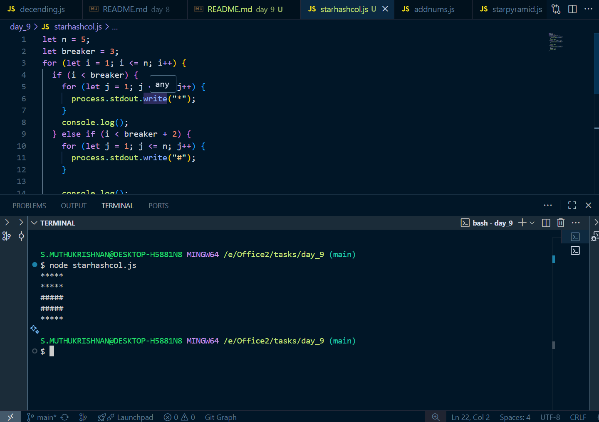
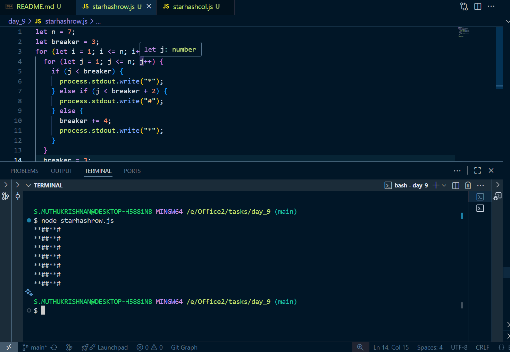
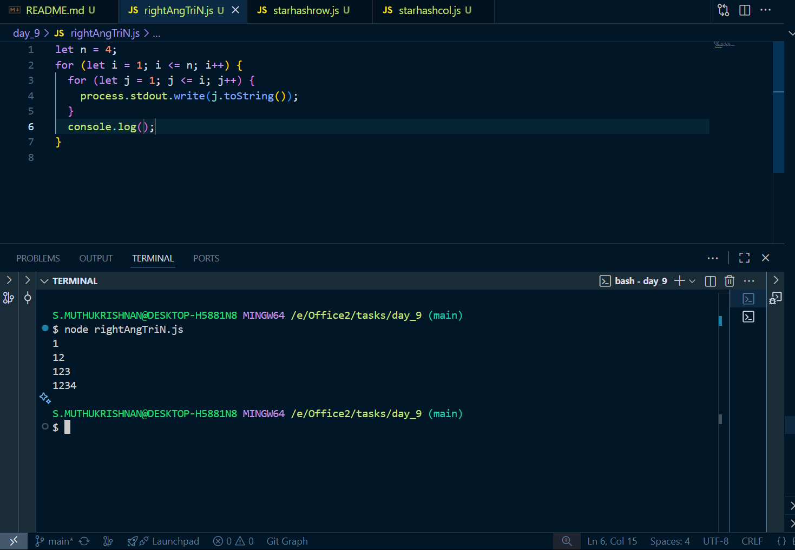
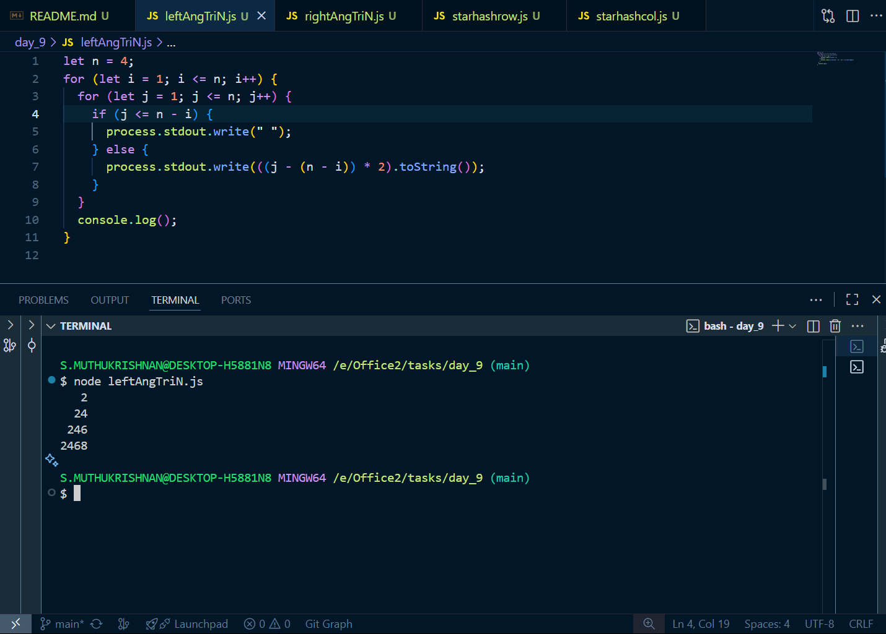

# Day 9 tasks

## 1. starhashcol.js

<pre lang="javascript">
let n = 5;
let breaker = 3;
for (let i = 1; i <= n; i++) {
  if (i < breaker) {
    for (let j = 1; j <= n; j++) {
      process.stdout.write("*");
    }
    console.log();
  } else if (i < breaker + 2) {
    for (let j = 1; j <= n; j++) {
      process.stdout.write("#");
    }

    console.log();
  } else {
    for (let j = 1; j <= n; j++) {
      process.stdout.write("*");
    }
    breaker += 4;
    console.log()
  }
}
</pre>

### O/P

---

## 2. starhashrow.js

<pre lang="javascript">
let n = 7;
let breaker = 3;
for (let i = 1; i <= n; i++) {
  for (let j = 1; j <= n; j++) {
    if (j < breaker) {
      process.stdout.write("*");
    } else if (j < breaker + 2) {
      process.stdout.write("#");
    } else {
      breaker += 4;
      process.stdout.write("*");
    }
  }
  breaker = 3;
  console.log();
}
</pre>

### O/P

---

## 3. rightAngTriN.js

<pre lang="javascript">
let n = 4;
for (let i = 1; i <= n; i++) {
  for (let j = 1; j <= i; j++) {
    process.stdout.write(j.toString());
  }
  console.log();
}
</pre>

### O/P

---

## 4. leftAngTriN.js

<pre lang="javascript">
let n = 4;
for (let i = 1; i <= n; i++) {
  for (let j = 1; j <= n; j++) {
    if (j <= n - i) {
      process.stdout.write(" ");
    } else {
      process.stdout.write(((j - (n - i)) * 2).toString());
    }
  }
  console.log();
}
</pre>

### O/P

